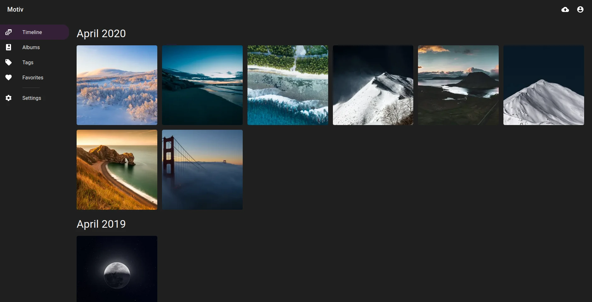

# MOTIV

_A place for your family photos and videos... Some day!_

## State 
- Serves SPAs
- Talks GraphQL
- Stores in postgres
- Caches images to WebP (ultra lightweight?)
- Doesn't crash
- Lots of low hanging fruits...

## Quickstart demo 
1. Make sure your system has `make`, `docker`, and `docker-compose`
1. Run `make demo` from the root of the project and you'll have a demo environment up and running with some sample data

## Frontend-only Development Prerequisites
- make
- docker + docker-compose
- yarn
- node

### Frontend-only Build & Run 
1. `make demo`
1. Go into the frontend folder
1. `yarn install && yarn build`
1. `yarn run`

## Fullstack Development Prerequisites
The following is a list of all things required to develop within all parts of motiv.
 - docker + docker-compose
 - yarn
 - node
 - rust
 - diesel_cli
 - postgres client library (required for compilation apparently)

### Fullstack Build & Run 
`make setup-dev-env` does the following:
1. fetches sample data to the backend folder
1. sets up a postgres instance via docker
1. sets up a sample motiv.toml config file (backend folder)
1. builds the frontend (yarn) and backend (rust)

After all those steps have completed, `make run` will go into the backend folder and run the server. 

You should now be able to visit the frontend at localhost:5000. There's a graphql-viewer at /graphql as well. 

## Acknowledgements
Special thanks to @lucperkins and his repository at https://github.com/lucperkins/rust-graphql-juniper-actix-diesel-postgres 
